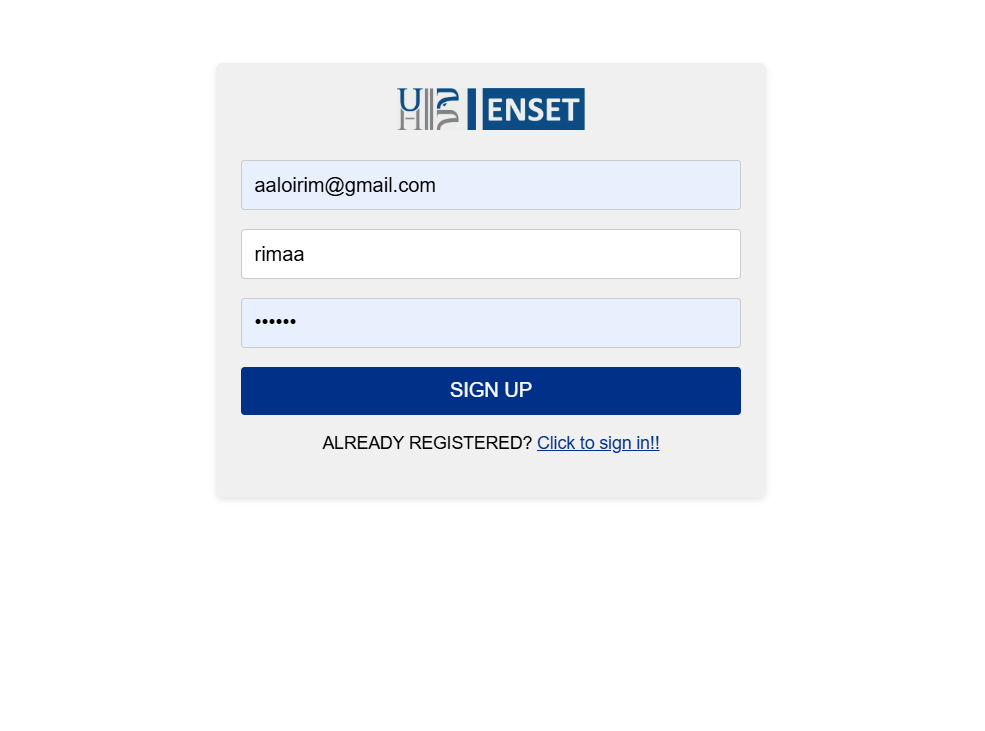
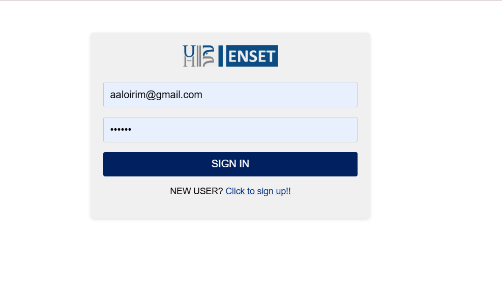

# 🔐 Authentication System - Angular Version

This project implements a complete user authentication system (Signup, Login, Logout) using Angular framework with JSON Server as a mock backend.

## 🚀 Features
- Protected dashboard
- Session management
- Route guards for protected routes
- Responsive design

## 🛠️ Technologies
- Angular 16+
- Angular Router
- Angular Forms (Reactive Forms)
- Angular HTTP Client
- JSON Server (mock backend)
- RxJS for state management
- Bootstrap 5 for styling

## 🏁 Getting Started

### Prerequisites
- Node.js 16+
- Angular CLI
- JSON Server

## 📂 Project Structure
```

```
## 📝 Available Scripts

- `npm start`: Start development server
- `npm run server`: Start JSON Server
- `npm run build`: Production build
- `npm test`: Run tests

## 📸 Screenshots
*Login Page*
  
*Signup Page*
  
*Dashboard*
  

## 💌 Author

👩‍💻 **Rim Aaloi**  
💌 Contact: [GitHub Profile](https://github.com/RimAaloi) | [LinkedIn](https://www.linkedin.com/in/rim-aaloi/)  


