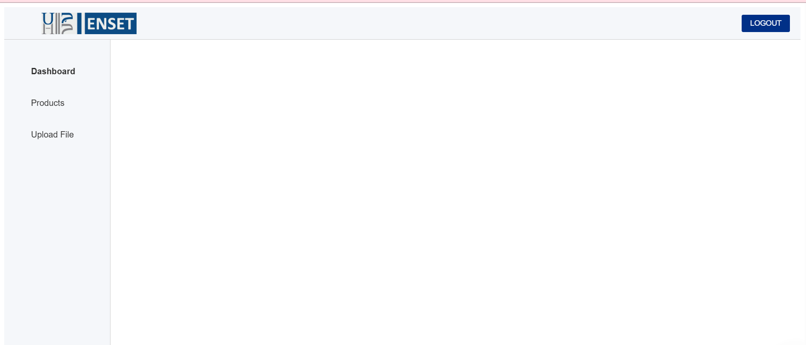

# 🔐 Authentication System - Angular Version

This project implements a complete user authentication system (Signup, Login, Logout) using Angular framework with JSON Server as a mock backend.

## 🚀 Features
- Protected dashboard
- Session management
- Route guards for protected routes
- Responsive design

## 🛠️ Technologies
- Angular 16+
- Angular Router
- Angular Forms (Reactive Forms)
- Angular HTTP Client
- JSON Server (mock backend)
- RxJS for state management
- Bootstrap 5 for styling

## 🏁 Getting Started

### Prerequisites
- Node.js 16+
- Angular CLI
- JSON Server

## 📂 Project Structure
```
├── public/
│ └── screenshots/ 
├── src/
│ ├── app/
│ │ ├── dashboard/ 
│ │ │ ├── dashboard.component.css
│ │ │ ├── dashboard.component.html
│ │ │ ├── dashboard.component.spec.ts
│ │ │ └── dashboard.component.ts
│ │ │
│ │ ├── login/
│ │ │ ├── login.component.css
│ │ │ ├── login.component.html
│ │ │ ├── login.component.spec.ts
│ │ │ └── login.component.ts
│ │ │
│ │ ├── signup/ 
│ │ │ ├── signup.component.css
│ │ │ ├── signup.component.html
│ │ │ ├── signup.component.spec.ts
│ │ │ └── signup.component.ts
│ │ │
│ │ ├── app.component.css
│ │ ├── app.component.html
│ │ ├── app.component.spec.ts
│ │ ├── app.component.ts
│ │ ├── app.config.server.ts
│ │ ├── app.config.ts
│ │ ├── app.routes.server.ts
│ │ ├── app.routes.ts
│ │ ├── auth.service.spec.ts
│ │ └── auth.service.ts
│ │
│ └── ... # Autres fichiers src (index.html, main.ts etc.)
├── ... # Fichiers racine (angular.json, package.json etc.)


```
## 📝 Available Scripts

- `npm start`: Start development server
- `npm run server`: Start JSON Server
- `npm run build`: Production build
- `npm test`: Run tests

## 📸 Screenshots
*Login Page*
  
*Signup Page*
  
*Dashboard*
  

## 💌 Author

👩‍💻 **Rim Aaloi**  
💌 Contact: [GitHub Profile](https://github.com/RimAaloi) | [LinkedIn](https://www.linkedin.com/in/rim-aaloi/)  


